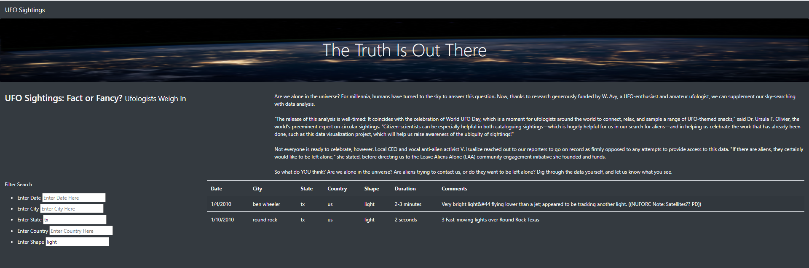

# UFOs

## Overview of UFOs Analysis

### Purpose

###### The purpose of Module Eleven and the UFOs Analysis Challenge is to use JavaScript "standard" and JavaScript version ES6+ (aka ES2015) to create, populate, and dynamically filter an HTML table.  A webpage was created and customized using JavaScript, HTML, CSS, and Bootstrap components to display data of UFO sightings and allowing users to filter UFO sightings by date, city, state, country, and shape of the sighting.

### Results

###### To use the UFO Sightings webpage, a user would need to enter one or more search criteria based on date, city, state, country, and shape of the sighting.  For example, a Texas resident would enter "tx" in the state input box to determine which UFO sightings occurred in their home state.  To narrow the results further, the user could enter "light" as the shape of the sighting and would be able to determine that the state of Texas had two reported UFO sightings as light and could review a filtered table of these two reported sightings.

### Summary

###### The drawback of this new design is the lack of filter button. In my opinion, I believe it would be beneficial to the user to add a filter button or reset button on the UFO Sightings webpage.  Currently the user must manually delete the search criteria entered and is not beneficial to the user.  Therefore I'd recommend adding a filter or reset button to the webpage to make it more user-friendly and secondly, I'd add more data to the data.js dataset so users can search for recent UFO Sightings based on their search criteria.